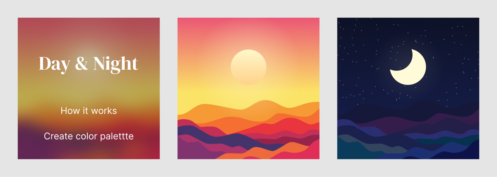

# Day & Night plugin for Penpot

This is a simple plugin to create light and dark color palettes in a Penpot file and switch between them. Many designs have light and dark modes, this makes it easier to work with them in Penpot.



## How to use it

It's best if you start using this plugin with a brand new file. You can also use it with an existing one, you just might need to re-organize your colors (see how it works below).

When you click "Create color palette", the plugin sets up ~20 colors for you in your library. It includes 10 neutral colors (white to black), and 10+ extra colors along the rainbow. Use all of those colors in your design.

When you close the plugin menu, you'll see a landscape that shows either day or night. Click it to switch the library colors between light and dark modes.

## Adjusting the color palette

When you need to make changes, make sure to tweak the colors in the "Day" and "Night" folders. Those are the source colors the plugin uses to switch themes (more on that below in how it works).

## How it works

The plugin relies on a very specific organization of the colors in your library. Each color needs to have 3 variations. There's the primary one that you will use in your designs. Then there are two copies with the same name, but in "Day" and "Night" folders respectively. It looks like this:

- Blue
- Day / Blue
- Night / Blue

When the plugin switches between themes, it simply copies the color values from one of the colors in the Day/Night folders, to the main color.

## Delecting the color palette

There's a hidden feature to delete all the colors the plugin has created, or that match the structure above in how it works. Shift-click the "Day & Night" title in the menu. 

## Project Setup

```sh
nvm use
npm install
```

### Compile and Hot-Reload for Development

```sh
npm run dev
```

### Compile and Minify for Production

```sh
npm run build
```
